#  GO command
## 一、 command

### 1 run

编译并运行test.go，生成可执行文件到临时目录，但不会移动到当前源文件目录

```go
go run main.go
```

### 2. build

编译生成可执行文件

```go
go build main.go
```
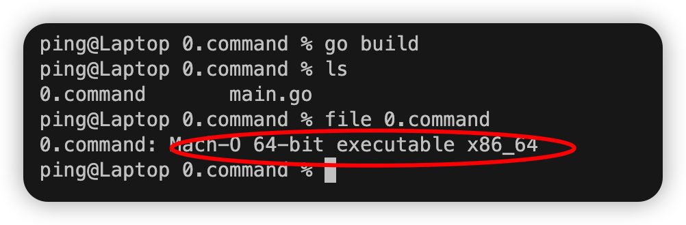


### 3. clean

清除当前目录下的代码产生的对象文件，仅保留源代码

```go
go clean
```
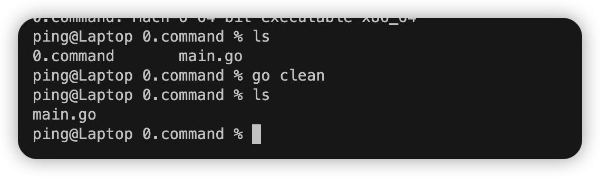

### 4. env

查看当前go环境的配置

```go
go env
```
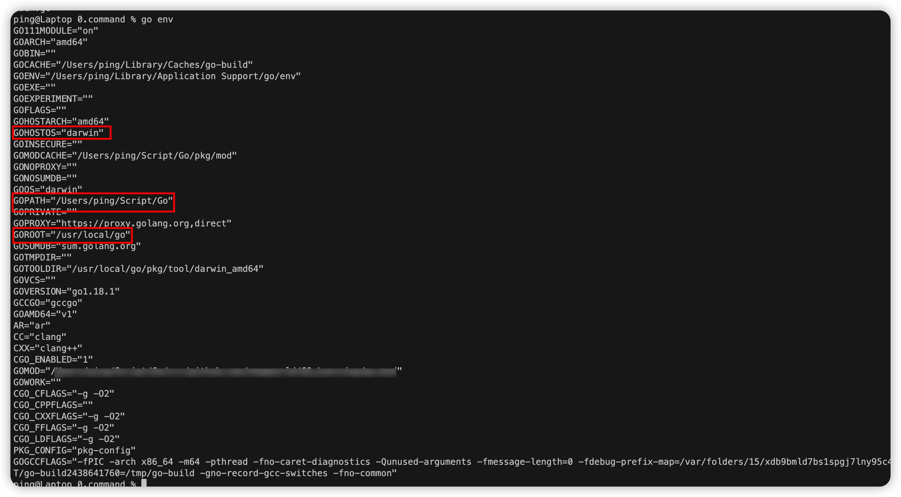


### 5. fmt

运行gofmt对代码进行格式化处理

```go
go fmt main.go
```

### 6. get

下载并安装包和依赖

```go
go get https://github.com/lxn/walk
```

### 7. list

列出的包

```go
go list
```
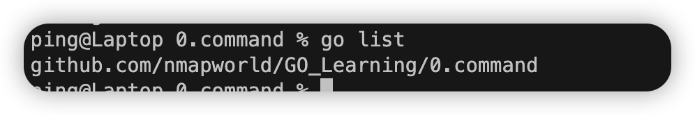

### 8. version
`查看go可执行程序的build信息`
```bash
go version -m main
```
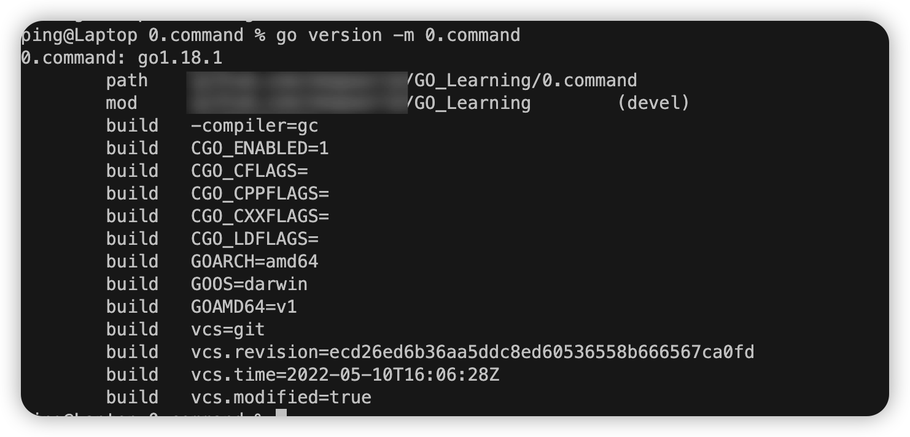
## 二、set

### 1. China source

```bash
go env -w GOPROXY=https://goproxy.cn,direct
```

### 2. Enable modules

```bash
go env -w GO111MODULE=on
```

### 3. Golang Env

```bash
go env -w set GOROOT=D:\Program Files\Go
go env -w set GOPATH=C:\Users\Administrator\go
```

### 4. Init GoPath
```go
go init 目录
```

### 5.Build
```bash

CGO_ENABLED=0 GOOS=windows GOARCH=amd64 go build
CGO_ENABLED=0 GOOS=linux GOARCH=amd64 go build
CGO_ENABLED=0 GOOS=darwin GOARCH=amd64 go build
```
Build Option:
```bash
go build -buildvcs=false    //关闭VCS信息
go build -ldflags="-w -s"   //去除调试信息
```
## 三、 基础结构
```go
// 包声明
package main

// 引入包
import "fmt"

// 定义常量
const PI = 3.1415

// 变量声明和赋值
var str = "Hello世界"

// 一般类型的声明
type ar int

// 结构的声明
type ar2 struct{}

// 接口的声明
type inter interface{}

// 函数名等首字母大写可全局调用，否则仅当前程序调用

// main函数作为程序的入口点启动
func main() {
	fmt.Println("Hello Wolrd")
}
```

## 四、Go执行原理

### 1. go run
查看go run使用的临时目录
```go
go run -work main.go
```
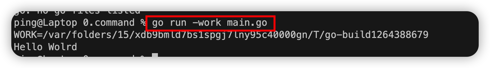
查看go run 时的工作流程
```go
go run -n main.go
```
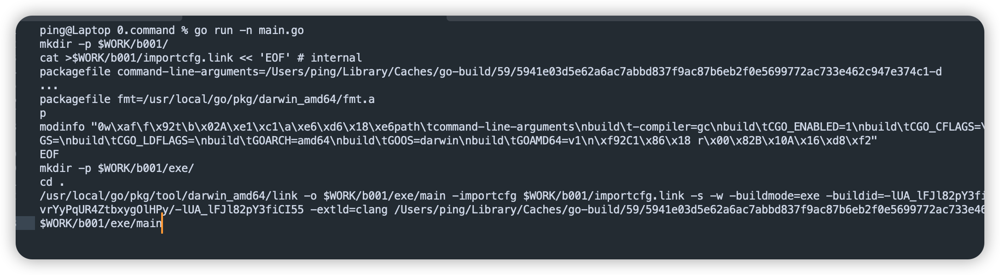
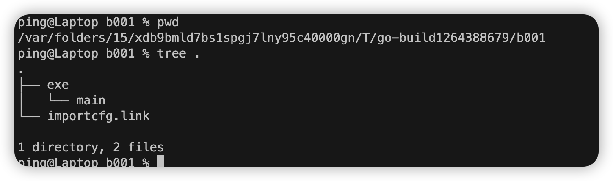
如下图所示：期间会在临时 执行:mkdir -p $WORK/b001/exe/，生成两个文件目录	***b001***  ***exe***,先执行了 compile 命令，然后 link，生成了归档文件.a 和 最终可执行文件，最终的可执行文件放在 exe 文件夹里面。命令的最后一步就是执行了可执行文件

### 2. go build
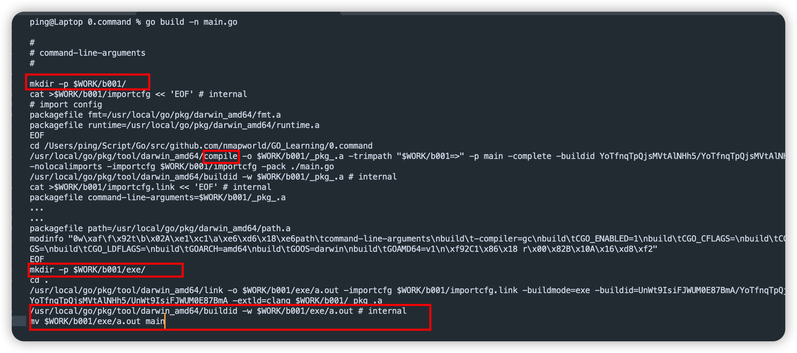
相对于go run等于多了将可执行程序移动到 ***源文件目录***
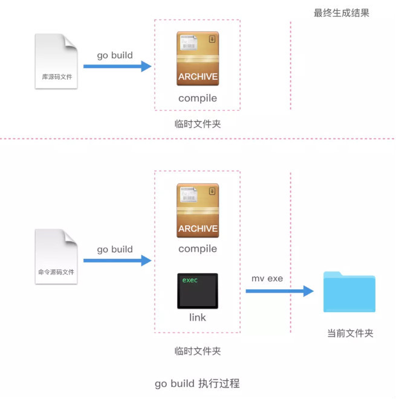
### 3. go install

### 4. go get


## 五、代码规范

### 1. 命名规范

* * *


```go
// 文件名：
// 尽量采取有意义的文件名，简短，有意义，应该为小写单词，使用下划线分隔各个单词。
my_test.go


// 包名: package
// 保持package的名字和目录保持一致,包名应该为小写单词，不要使用下划线或者混合大小写
package main
package demo


// 结构体命名：
// 采用驼峰命名法，首字母根据访问控制大写或者小写
// struct 申明和初始化格式采用多行，例如下面：
// 多行申明
type User struct{
    Username  string
    Email     string
}

// 多行初始化
u := User{
    Username: "astaxie",
    Email:    "astaxie@gmail.com",
}

// 接口命名：
// 命名规则基本和上面的结构体类型
// 单个函数的结构名以 “er” 作为后缀，例如 Reader , Writer 。
type Reader interface {
        Read(p []byte) (n int, err error)
}

// 变量命名：
// 和结构体类似，变量名称一般遵循驼峰法，首字母根据访问控制原则大写或者小写，但遇到特有名词时，需要遵循以下规则：
// 如果变量为私有，且特有名词为首个单词，则使用小写，如 apiClient
// 其它情况都应当使用该名词原有的写法，如 APIClient、repoID、UserID
// 错误示例：UrlArray，应该写成 urlArray 或者 URLArray
// 若变量类型为 bool 类型，则名称应以 Has, Is, Can 或 Allow 开头
var isExist bool
var hasConflict bool
var canManage bool
var allowGitHook bool

// 常量：
// 常量均需使用全部大写字母组成，并使用下划线分词
const APP_VER = "1.0"
// 枚举类型的常量，需要先创建相应类型
type Scheme string

const (
    HTTP  Scheme = "http"
    HTTPS Scheme = "https"
)
```

关键字：25个
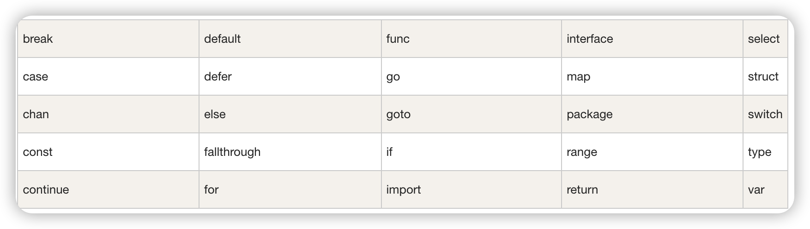

预定义标识符号：36个
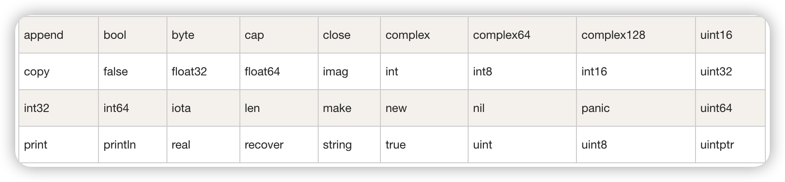
### 2. 注释
单行注释
```go
//单行注释
```
多行注释
```go
/*
多行注释
*/
```


### 3. 代码风格
任何err都推荐进行处理，不使用"_"匿名变量丢弃
```go
// 错误写法
if err != nil {
    // error handling
} else {
    // normal code
}

// 正确写法
if err != nil {
    // error handling
    return // or continue, etc.
}
// normal code
```
[上一页](README.md)  [首页](README.md)  [下一页](1.var.md)