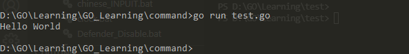
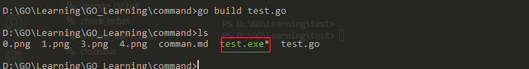
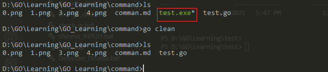
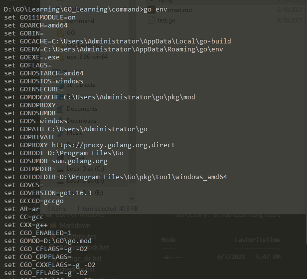
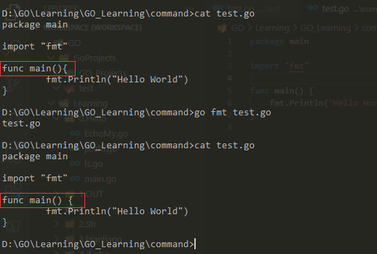
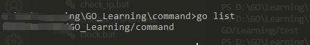

#  GO command
## 一. command

### 1. run

编译并运行test.go，但本地不会生成可执行文件

```go
go run test.go
```



### 2. build

编译生成可执行文件

```go
go build test.go
```



### 3. clean

清除当前目录下的代码产生的对象文件，仅保留源代码

```go
go clean
```



### 4. env

查看当前go环境的配置

```go
go env
```



### 5. fmt

运行gofmt对代码进行格式化处理

```go
go fmt test.go
```



### 6. get

下载并安装包和依赖

```go
go get https://github.com/lxn/walk
```

### 6. list

列出的包

```go
go list
```



## 二、set

### 1. China source

```bash
go env -w GOPROXY=https://goproxy.cn,direct
```

### 2. Enable modules

```bash
go env -w GO111MODULE=on
```

### 3. Golang Env

```bash
go env -w set GOROOT=D:\Program Files\Go
go env -w set GOPATH=C:\Users\Administrator\go
```

### 4. Init GoPath
```go
go init 目录
```

## 三. 基础知识
```go
// 当前程序的包名
package main

// 导入其他的包
import "fmt"

// 定义常量
const PI = 3.1415

// 变量声明和赋值
var str = "Hello世界"

// 一般类型的声明
type ar int

// 结构的声明
type ar2 struct{}

// 接口的声明
type inter interface{}

// 函数名等首字母大写可全局调用，否则仅当前程序调用

// main函数作未程序的入口点启动
func main() {
	fmt.Println("Hello Wolrd")
}

```

## 四. 知识体系

### 1. 运算符(Opeartor)
#### a.算术运算符
    \+ \- \* / % 
#### b.逻辑运算符
    && || !
#### c.位运算符
    \>\> << | ^ &
#### d.赋值运算符
    = += -=

独立的语句：++ --
#### e.比较运算符
    < > <= >=

### 2. 数组(Array)
一定长度和类型元素的集合体，为值类型

初始化时值为对应的零值，0 "" "false"

```go
var n[2]={1,2}
var str[3]={"清明","上","河图"}
fmt.Println(n,str)
```

二维数组
```go
var a1[3][2]int  //[[1,2],[3,4],[5,6]]
// (多维数组的外层长度可以省略)等同 var a1[...][2]int
```

### 3. 切片(Slice)
具有指针、元素、容量属性的引用数组
切片为引用类型，底层指向到数组
修改切片元素的值时，其对应的内存地址不变
```go
var s1:=[]int
// 声明切片s1,未初始化时的值为nil，表示未分配内存

s1=[]int{1,2,3}  //初始化1
s2:=make([]bool,2,4) //初始化2.定义长度2，容量4
```
![s1=a[0:4]](7.png)
扩容策略：
切片追加元素,当本身切片固定容量存储不下时:

if old cap<1024;newcap=2*old cap

if old cap>=1024;newcap=old cap+1/4(old cap)*n

如果new cap溢出，则newcap=new len

使用append时，必须使用变量接受返回值
### 4. 指针(Pointer)
&: 取内存地址

*: 通过地址获取对应的值

GOlang中的指针only-ready，不能修改变量指向的内存地址
```go
str1 := "Hello world"
// 查询内存地址(内存地址为十六进制)
fmt.Println(&str1)
// *string:string类型指针 *int:int类型指针
fmt.Printf("内存地址10进制表示为: %d,数据类型为：%T\n", &str1, &str1)
// 根据内存地址查询对应的值
fmt.Println(*(&str1))
```

### 5. 字典(map)
存储键值对的数据，使用时需先申请内存地址
```go
package main

import "fmt"

func main() {
	var map1 map[int]string
    // map1为nil，无内存地址
	if map1 == nil {
		map1 = make(map[int]string, 10)
	}
	map1[0] = "小明"
	map1[2] = "小花"
	fmt.Println(map1)

}
```

### 6. 函数（func)
### 7. 结构体(struct)


