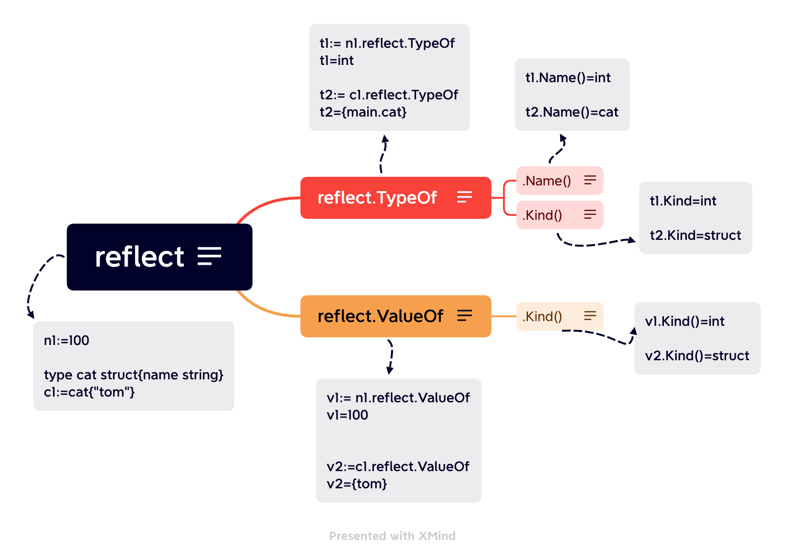

# 反射
>Go语言提供了一种机制，能够在运行时更新变量和检查它们的值、调用它们的方法和它们支持的内在操作，而不需要在编译时就知道这些变量的具体类型。这种机制被称为反射。反射也可以让我们将类型本身作为第一类的值类型处理
* 在Go语言的反射机制中，任何接口值都由是一个 **具体类型** 和 **具体类型的值** 两部分组成的
* 在Go语言中，使用reflect.TypeOf()函数可以获得任意值的类型对象（reflect.Type），程序通过类型对象可以访问任意值的类型信息。



## 1.基础
```go
package main

import (
	"fmt"
	"reflect"
)

// 反射的使用

type cat struct {
	name string
}

func reflectType(x interface{}) {

	// reflect.TypeOf() 获取对象的类型
	// reflect.ValueOf() 获取对象的值
	t := reflect.TypeOf(x)
	v := reflect.ValueOf(x)
	fmt.Printf("valus:%v\ttype:%v\n", v, t)
	fmt.Printf("typename:%v\t typekind:%v\n", t.Name(), t.Kind()) //t.Name():类型的名字 t.Kind()：类型的在go语言中归属的种类 
	fmt.Printf("Valuekind:%v\n", v.Kind())                        //v.Kind():值的种类
}

func reflectName(n interface{}) {

	v := reflect.ValueOf(n)
	k := v.Kind()
	switch k {
	case reflect.Int64:
		fmt.Printf("type is int64 ,value is %d\n", int64(v.Int()))
	case reflect.Float32:
		fmt.Printf("type is Float32 ,value is %f\n", float32(v.Float()))
	case reflect.Float64:
		fmt.Printf("type is Float64 ,value is %f\n", float64(v.Float()))
	}
}

func reflectSetValue(x interface{}) {
	v := reflect.ValueOf(x)
	if v.Elem().Kind() == reflect.Int {
		v.Elem().SetInt(200)
	} else {
		fmt.Println("err")
	}
}

func main() {
	n1 := 100
	reflectType(n1) //int 100
	n2 := 3.1415
	reflectType(n2) //float64 3.1415
	c := cat{
		name: "tom",
	}
	// 反射类型
	// 反射的类型：类型(type)+种类(kind)
	reflectType(c)

	// 反射的值
	a1 := 3.1415
	reflectName(a1)

	// 修改反射的值
	// 使用值引用，则修改的副本；使用地址引用，则修改原件
	reflectSetValue(&n1)
	fmt.Println(n1)
}

```
## 2.反射操作

### 2.1反射遍历结构体
```go
//结构体反射
package main

import (
	"fmt"
	"reflect"
)

// 定义学生结构体
type student struct {
	name  string `json:"name" zhoulin:"嘿嘿嘿"`
	score int    `json:"score" zhoulin:"嘿嘿嘿"`
}

func main() {

	// 实例化结构体：student
	newStu := student{
		name:  "小王子",
		score: 99,
	}
	t := reflect.TypeOf(newStu)
	// 打印newStu类型：类型名，种类
	fmt.Println(t.Name(), t.Kind()) //student struct

	// for循环遍历结构体中的所有字段
	// NumField()方法返回结构中字段的数量，Field(i int)方法返回字段I的reflect.Value。
	for i := 0; i < t.NumField(); i++ {
		field := t.Field(i)
		fmt.Printf("name:%v index:%v type:%v json tag %v\n", field.Name, field.Index, field.Type, field.Tag.Get("zhoulin"))
	}
    // name:name index:[0] type:string json tag 嘿嘿嘿
    // name:score index:[1] type:int json tag 嘿嘿嘿

	// 通过字段名获取指定结构体字段信息
	fmt.Println("通过字段名获取指定结构体字段信息")
	if scoreField, ok := t.FieldByName("score"); ok {
		fmt.Printf("name:%v index:%v type:%v json tag %v\n", scoreField.Name, scoreField.Index, scoreField.Type, scoreField.Tag.Get("zhoulin"))
	}
    // name:score index:[1] type:int json tag 嘿嘿嘿
}
```

[上一页](13.interface.md)  [首页](README.md)  [下一页](15.error.md)