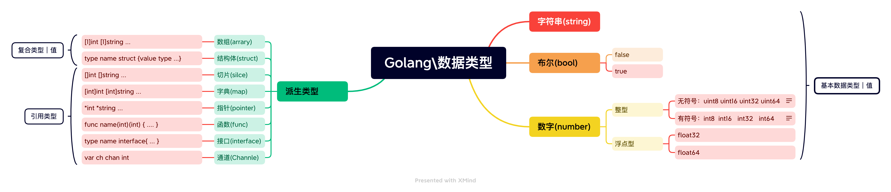

# <center>数据类型


## 一、数字
### 1. 整型
#### 1.1 有符号整型
`int8 int16 int32 int64`
包含零和负数，左包右不包
|int8 |int16| int32| int64|
|---|---|---|---|
|-($2^8$)/2..0..($2^8$)/2-1|-($2^16$)/2...($2^16$)/2-1|...|...|
```go
func main(){
	var a1 = new(int8)
	var a2 = new(int16)
	var a3 = new(int32)
	var a4 = new(int64)
	fmt.Printf("%v: %T\t%v: %T\t%v: %T\t%v: %T\t\n", *a1, *a1, *a2, *a2, *a3, *a3, *a4, *a4)
        //0: int8	0: int16	0: int32	0: int64
	
}

```
#### 1.2 无符号整型
|uint8 |uint16| uint32| uint64
|---|---|---|---|
|($2^8$): 0-255|($2^16$)|($2^32$|($2^64$)|
#### 1.3 其他
byte   : uint8
rune   : int32
```go
package main

import "fmt"

// Byte和rune类型
// go语言中为了非处理ASCII码类型的字符，定义了新的rune类型

func main() {

	a := '2'
	b := '新'
	fmt.Printf("%T,%T\n", a, b)
	stringMy := "Hello안녕하세요.こんにちは"
	stringMy2 := "Helloword"
	n := len(stringMy)
	fmt.Printf("%s\t", stringMy)
	fmt.Println(n)

	// 遍历字符串
	// byte遍历
	for i := 0; i < len(stringMy2); i++ {
		fmt.Printf("(%c)字符的十进制ASCII码为：%v\n", stringMy2[i], stringMy2[i])
	}
	fmt.Println("")
	// rune遍历
	for _, c := range stringMy {
		fmt.Printf("%T\t", c)
		fmt.Printf("%c\t", c)
		fmt.Println()
	}
}

```
### 2. 浮点型
#### 2.1 float32
#### 2.1 float64

## 二、布尔
ture false


## 三、字符串
`字符串就是一串固定长度的字符连接起来的字符序列。Go的字符串是由单个字节连接起来的。Go语言的字符串的字节使用UTF-8编码标识Unicode文本
`
```go
func stringDo() {

	name := "Sherlock"
	goods := "dog"
	// 字符串拼接
	words := fmt.Sprintf("%s like %s", name, goods)
	println(words) //Sherlock like dog
	// 字符串长度（包含空格）
	println(len(words)) //17
	// 字符串切割
	ret := strings.Split(words, "l")
	fmt.Println(ret) //[Sher ock  ike dog]
	// 判断是否包含
	ret1 := strings.Contains(words, "like")
	fmt.Printf("%T\t", ret1) //bool    
	fmt.Println(ret1) //true
	// 前缀是否包含
	fmt.Println(strings.HasPrefix(words, "S")) //true
	// 后缀是否包含
	fmt.Println(strings.HasSuffix(words, "S")) //false
	// 判断字符第一次出现的位置
	fmt.Println(strings.Index(words, "l")) //4
	// 判断字符最后一次出现的位置
	fmt.Println(strings.LastIndex(words, "l")) //9
	// 列表拼接
	fmt.Println(strings.Join(ret, "+")) //Sher+ock +ike dog
}

func changeString() {
	// 字符串修改

	s1 := "Hello world"
	// (int8)英文字符串转为byte类型切片，才能修改
	s2 := []byte(s1)
	s2[3] = 'H'
	fmt.Printf("%v\n", s1) //Hello world
	fmt.Printf("%c\n", s2) //[H e l H o   w o r l d]
	//Byte类型字符串长度读取
	fmt.Println(len(s1)) //11
	for i := 0; i < len(s2); i++ {
		fmt.Printf("%c", s2[i])
	}
	fmt.Println(string(s2))
	fmt.Println("\n------------")
	n1 := "我的家在东北，松花江上SOHO"
	// (utf-8)非ASCII字符串转为rune类型切片，才能修改
	n2 := []rune(n1)
	n2[0] = '你'
	fmt.Println(n1)
	//rune类型字符串长度读取
	fmt.Println(len(n1))
	fmt.Println(utf8.RuneCountInString(n1))
	fmt.Printf("%c\n", n2)
	for _, c := range n2 {
		fmt.Printf("%c", c)
	}
	fmt.Println("\n------------")
	fmt.Println(string(n2))

}
```
## 三、类型转化
使用strconv包可以相互转化
```go
package main

// Parse: string -> Other
// Format: Any ->string

// Quote: 将不可打印的数据，转义
// IsPrint: 判断是否可打印
// Append: 添加数据

import (
	"fmt"
	"strconv"
)

//str := "1000"
func strToInt(str string) {

	n, err := strconv.Atoi(str)
	if err != nil {
		fmt.Println(err)
	}
	fmt.Printf("%#v type:%T \n", n, n) //1000 type:int
}

//num := 1024
func intTostr(i int) {
	str := strconv.Itoa(i)
	fmt.Printf("%#v type is %T\n", str, str) //"1024" type is string

}

func stringToBool() {
	fmt.Println("string to Bool")
	fmt.Println(strconv.ParseBool("0"))     //false
	fmt.Println(strconv.ParseBool("f"))     //false
	fmt.Println(strconv.ParseBool("F"))     //false
	fmt.Println(strconv.ParseBool("FALSE")) //false
	fmt.Println(strconv.ParseBool("false")) //false

	fmt.Println(strconv.ParseBool("1"))     //true
	fmt.Println(strconv.ParseBool("t"))     //true
	fmt.Println(strconv.ParseBool("T"))     //true
	fmt.Println(strconv.ParseBool("TRUE"))  //true
	fmt.Println(strconv.ParseBool("true"))  //true

}

//strF := "3.1415"
func stringToFloat(strF string) {
	str, _ := strconv.ParseFloat(strF, 64)
	fmt.Printf("%v %T\n", str, str) //3.1415 float64

}

// floatStr := 3.1415
func floatToStr(f float64) {
	str := strconv.FormatFloat(f, 'f', 4, 64)
	fmt.Printf("%v %T\n", str, str) //"3.1415" string

}

func main() {
	// str ->int
	str := "1000"
	strToInt(str)

	// int -> string
	num := 1024
	intTostr(num)

	// string -> bool
	// 当str为：1，t，T，TRUE，true，True中的一种时为真值
	// 当str为：0，f，F，FALSE，false，False中的一种时为假值
	stringToBool()

	// string -> float
	strF := "3.1415"
	stringToFloat(strF)

	// float -> string
	floatStr := 3.1415
	floatToStr(floatStr)

}

```
[上一页](2.const.md)  [首页](README.md)  [下一页](4.operator.md)