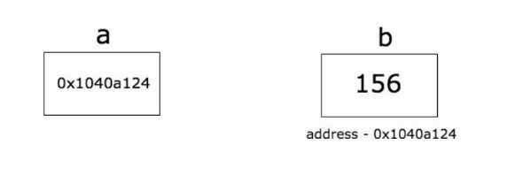

# 指针
`指针是存储另一个变量的内存地址的变量`

如上图，变量b的值为156，存储在内存地址0x1040a124。变量a持有b的地址，现在a被认为指向b。
```go
// go语言中不存在指针操作
// &：取地址
// *：根据地址取值
package main

import "fmt"

func main() {
   var a int = 10   

   fmt.Printf("变量的地址: %x\n", &a  ) //变量的地址: 20818a220
}
```
## 1.声明及初始化
```go
func new_pointer() {
	// 创建指针
	// 空指针，nil
	// 1.new函数创建内存地址(对象为int; string...),返回为对应类型的指针
	var a *int
	fmt.Println(a)
	// 合规方式,先申请内存
	var a1 = new(int)
	fmt.Println(*a1)
	*a1 = 100
	fmt.Println(a1)

	// 2.make函数创建内存地址(对象为：slice\map\chan)，返回值为类型本身
}
```
实例：
``` go
package main

import "fmt"

func main() {
   var a int= 20   /* 声明实际变量 */
   var ip *int        /* 声明指针变量 */

   ip = &a  /* 指针变量的存储地址 */

   fmt.Printf("a 变量的地址是: %x\n", &a  ) //a 变量的地址是: 20818a220

   /* 指针变量的存储地址 */
   fmt.Printf("ip 变量的存储地址: %x\n", ip ) //ip变量的存储地址: 20818a220

   /* 使用指针访问值 */
   fmt.Printf("*ip 变量的值: %d\n", *ip ) //*ip 变量的值: 20
}
```
## 2.指针操作
```go
package main  
import (  
    "fmt"
)

func main() {  
    b := 255
    a := &b
    fmt.Println("address of b is", a)
    fmt.Println("value of b is", *a)
}
```
### 2.1使用指针修改int
```go
package main

import (  
    "fmt"
)

func change(val *int) {  
    *val = 55
}
func main() {  
    a := 58
    fmt.Println("value of a before function call is",a) //value of a before function call is 58  
    b := &a
    change(b)
    fmt.Println("value of a after function call is", a) //value of a after function call is 55
}
```

### 2.2使用指针修改数组
```go
//推荐使用切片对数组进行修改
package main

import (  
    "fmt"
)

func modify(arr *[3]int) {  
    (*arr)[0] = 90
}

func main() {  
    a := [3]int{89, 90, 91}
    modify(&a)
    fmt.Println(a) //[90 90 91]
}
```
### 2.3通过指针遍历切片
```go
func modityslice() {
	slice := []int{10, 100, 200}
	var ptr [3]*int //存放指针的切片
	// fmt.Println(slice)
	for i := 0; i < len(slice); i++ { //遍历切片
		ptr[i] = &slice[i] //将切片中元素对应的内存地址赋值给ptr中
	}
	for _, v := range ptr { //遍历ptr中的内存地址元素
		fmt.Printf("%d\t", *v) //根据内存地址打印对应的值
	}
	fmt.Println()
	//10      100     200
}
```
### 2.4指针的指针
```go
package main

import "fmt"

func main() {

   var a int
   var ptr *int
   var pptr **int

   a = 3000

   /* 指针 ptr 地址 */
   ptr = &a

   /* 指向指针 ptr 地址 */
   pptr = &ptr

   /* 获取 pptr 的值 */
   fmt.Printf("变量 a = %d\n", a )
   fmt.Printf("指针变量 *ptr = %d\n", *ptr )
   fmt.Printf("指向指针的指针变量 **pptr = %d\n", **pptr)
}
结果
变量 a = 3000
指针变量 *ptr = 3000
指向指针的指针变量 **pptr = 3000
```
### 2.5指针作为函数参数
```go
指针package main

import "fmt"

func main() {
   /* 定义局部变量 */
   var a int = 100
   var b int= 200

   fmt.Printf("交换前 a 的值 : %d\n", a )
   fmt.Printf("交换前 b 的值 : %d\n", b )

   /* 调用函数用于交换值
   * &a 指向 a 变量的地址
   * &b 指向 b 变量的地址
   */
   swap(&a, &b);
   // a, b = b, a

   fmt.Printf("交换后 a 的值 : %d\n", a )
   fmt.Printf("交换后 b 的值 : %d\n", b )
}

func swap(x *int, y *int) {
   var temp int
   temp = *x    /* 保存 x 地址的值 */
   *x = *y      /* 将 y 赋值给 x */
   *y = temp    /* 将 temp 赋值给 y */
}
结果
交换前 a 的值 : 100
交换前 b 的值 : 200
交换后 a 的值 : 200
交换后 b 的值 : 100
```

## 3.空指针
>当一个指针被定义后没有分配到任何变量时，它的值为 nil。 nil 指针也称为空指针。 nil在概念上和其它语言的null、None、nil、NULL一样，都指代零值或空值。 一个指针变量通常缩写为 ptr。
```go
if(ptr != nil)     /* ptr 不是空指针 */
if(ptr == nil)    /* ptr 是空指针 */
```

[上一页](8.map.md)  [首页](README.md)  [下一页](10.func.md)